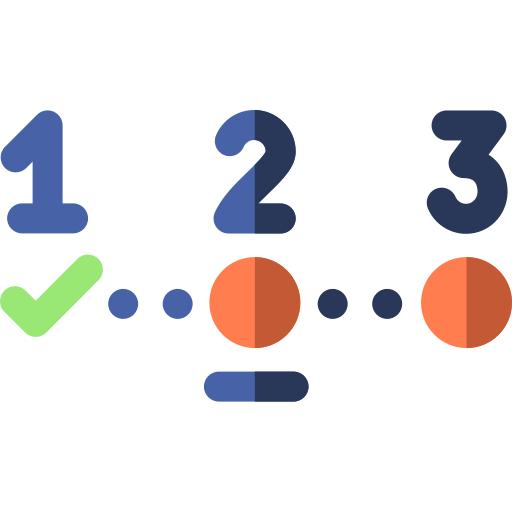

<p align="center" style="text-align:center">
    
</p>

# react-step-progress-bar-line

> functions for working with date

[](https://www.npmjs.com/package/react-step-progress-bar-line)

### Install

```shell
npm i react-step-progress-bar-line
```

import component styles to main scss style
```scss
@import "~react-line-progress-bar/dist/style/index.css";
```

```typescript jsx
import React, {useState} from 'react'
import ReactDOM from 'react-dom'

import {useStepProgressBar, StepProgressBarLine} from 'react-step-progress-bar-line'

export default function Index() {

    const [activeStep, sections, nextStep, prevStep] = useStepProgressBar({
        activeStep: 0,
        sections: [
            {
                stepsCount: 2
            },
            {
                stepsCount: 3
            },
            {
                stepsCount: 5
            },
        ],
        stepChangeCallback: (step) => {
            console.log('change',step);

            return true
        },
        finishCallback: () => {
            alert('finish');

            return true
        }
    })

    
    return (
        <div >

            <StepProgressBarLine activeStep={activeStep} sections={sections} />

            <button onClick={prevStep}>
                Prev
            </button>

            <button onClick={nextStep}>
                Nxt
            </button>


        </div>
    )

}

```

## Author

webster6667
